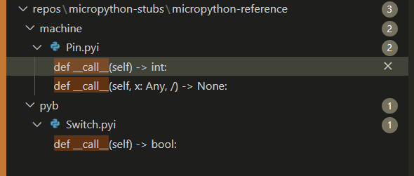

## stubber docstubs 
    
- [ ] docstubs : should automagically enrich the docstubs


- [ ] network : should proably not add 
     - from .WLANWiPy import *
    - from .WIZNET5K import *

## stubber enrich 

 -[x] enrich cmdline : change to source and destination

 - [x]  enrich : File comments are dupllicated within the same file
    - likely cause : merge same commont from multiple source 

 -[x] enrich : TypeAlias are copied in multiple times `
  - likely cause : merge same typealias from multiple source files 

 -[x] enrich : `_rp2.submodules` recieve too many imports that cannot be resolved 

- [x] during import - do not enhance the "u-module" stubs as this creates a tangle of incorrect imports 
    - there is already a list of u-modules in the stubber, so they should be simple to skip


- [x] improve copy imports during enrich
    - [x] do not copy imports from umodules to non-umodules
    - [x] do not copy `from foo import *` to module foo 
- [ ] imports :  copy trailing comments "# type: ignore "
- [ ] copy `FOO_BAR = const(0)` from source to dest
- [ ] copy `FOO_BAR:Final = something` from source to dest

## merge targets
- [x] rewrite logic for determining source --> target selection 
    - [x] reduce the number of candidates 
    - [x] avoid mergng fro umodule to module 
    - [x] avoid merging from __mpy_shed 
    - [x] avoid merging from pyb.__init to pyb.Accell
## stubber merge 
- [ ] Docstring is added multiple times s from multiple source files. 
    - likely cause : merge same docstring from multiple source files
- [ ] some decorators are added multiple times - need to check for existing decorator @final @final @final
- [x] machine.Pin.__call__ @overload decorator ends up only a single time in merged Stub ?


## micropython-Reference
 
- [x] _rp2.* 
    [x] fix  `from foo import bas as bar`
    [x] remove duplicate comments in `_rp2` files. 
    [x] remove duplicated docstrings 
    [x] remove rp2.irq module ( not needed, _IRQ provided from _mpy_shed )

    [x] for now revert to exposing just the 'rp2' module and hide the implementation details of `_rp2`

## _mpy_shed 
- [x] deque : `deque` is not a generic class.
- [ ] publish _mpy_shed to pypi ( or add to micropython-stdlib-stubs )
      > d:\mypython\micropython-stubber\repos\micropython-stubs\stubs\micropython-v1_24_1-docstubs\_mpy_shed\collections\__init__.pyi:327:35 - error: Expected no type arguments for class "deque" (reportInvalidTypeArguments)
      
      fix: class deque(MutableSequence[_T]):

 - [ ] `__call__` needs addational overloads in machine and pyb modules 
        

## rp2 / _rp2 documentation 
- [x] duplicate imports in `_rp2` files. 
    WORAROUND - remove _rp2 from stubs 
- [x] remove `rp2.irq` module ( not needed, _IRQ provided from _mpy_shed )

## neopixel
 - [x] class NeoPixel: - indexing
        https://github.com/Josverl/micropython-stubs/issues/764

        ERROR    root:typecheck.py:171 "tests/quality_tests/check_rp2/check_neopixel.py"(10,0): "__setitem__" method not defined on type "NeoPixel"
        ERROR    root:typecheck.py:171 "tests/quality_tests/check_rp2/check_neopixel.py"(12,10): "__getitem__" method not defined on type "NeoPixel"


## vfs 
- [ ] vfs.class AbstractBlockDev(ABC, _BlockDeviceProtocol): 
        AbstractBlockDev does not exist in the firmware-stubs , so is not merged into the merged stubs.

## stdlib

- [x] remove the `from from stdlib.xx import *` from lookup.py 
- [x] remove the `from from stdlib.xx import *` reference-stubs
- [ ] regenerate the docstubs 

- [x]  fix type stubs asyncio.StreamReader


### io

- [x] stdib - io 
- [x] IOBase changed to IOBase_mp 
- [x]    class StringIO(IOBase): -->  143:15 - error: Argument to class must be a base class

### time 
 - [ ] _TimeTuple has different formats/lengths on different platforms ( esp32 )
        - allow both 8 and 9-tuples 
        - add docstring to timetuple , refer to existing docpage
    ```
        d:\mypython\micropython-stubber\repos\micropython-stubs\stubs\micropython-v1_24_1-esp32-ESP32_GENERIC-merged\time.pyi:43:18 - warning: Import symbol "mktime" has type "(time_tuple: _TimeTuple | struct_time, /) -> float", which is not assignable to declared type "(local_time: _TimeTuple, /) -> int"
        Type "(time_tuple: _TimeTuple | struct_time, /) -> float" is not assignable to type "(local_time: _TimeTuple, /) -> int"
        Parameter 1: type "_TimeTuple" is incompatible with type "_TimeTuple | struct_time"
            Type "_TimeTuple" is not assignable to type "_TimeTuple | struct_time"
            "Tuple[int, int, int, int, int, int, int, int]" is not assignable to "tuple[int, int, int, int, int, int, int, int, int]"
                Tuple size mismatch; expected 9 but received 8
            "Tuple[int, int, int, int, int, int, int, int]" is not assignable to "struct_time"
    ```
### uasyncio
 - [ ] mod:socket - missing module constants 
    ERROR    root:typecheck.py:171 "tests/quality_tests/feat_micropython/check_functions.py"(5,7): "AF_INET" is not defined
    ERROR    root:typecheck.py:171 "tests/quality_tests/feat_micropython/check_functions.py"(5,16): "SOCK_STREAM" is not defined
    ERROR    root:typecheck.py:171 "tests/quality_tests/feat_micropython/check_functions.py"(7,7): "AF_INET" is not defined
    ERROR    root:typecheck.py:171 "tests/quality_tests/feat_micropython/check_functions.py"(7,16): "SOCK_DGRAM" is not defined

- [ ] uasyncio.Task 
        subclass : 
            class Task(futures._PyFuture):
        methods : 
        - cancel
        - __await__
        - s.read()  / __call__ ?>?


        INFO     root:typecheck.py:175 "tests/quality_tests/feat_uasyncio/check_demo/aiorepl.py"(67,26): Cannot access attribute "cancel" for class "Task"
        Attribute "cancel" is unknown
        INFO     root:typecheck.py:175 "tests/quality_tests/feat_uasyncio/check_demo/aiorepl.py"(69,26): "Task" is not awaitable
        "Task" is incompatible with protocol "Awaitable[_T_co@Awaitable]"
            "__await__" is not present


 - [x] Disable ruff warnings 
        - UP015, UP031, UP032

